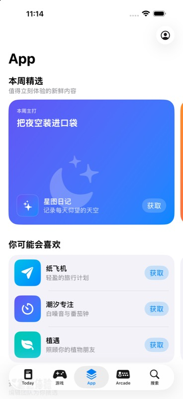
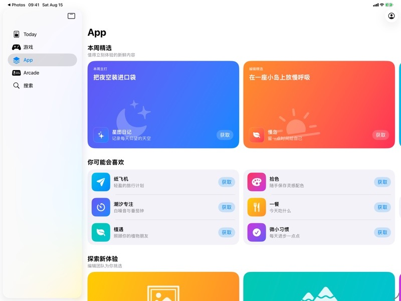

# App Store App 列表首页 Demo

这个 SwiftUI Demo 复现 App Store「App」Tab 刚进入时的主要信息架构：外层页面纵向滚动多个 section，每个 section 内横向滚动，并按“大卡片”“三行 App 列表”或“上下两张类别卡组成的一列”吸附到页面边缘。

## 运行环境

- Xcode 26
- iOS 26.0+
- Swift 6
- XcodeGen 2.46+

## 生成、运行与测试

```bash
cd app-store-apps-landing-demo
xcodegen generate
open AppStoreAppsLandingDemo.xcodeproj
```

在 Xcode 中选择 `AppStoreAppsLandingDemo` scheme 后运行，或通过仓库配置的 XcodeBuildMCP 在专属 iPhone 17 Pro Max 模拟器中执行 build、test 与 run。

## 关键代码

- `Domain/GroupingStrategy.swift`：把 App 预先分成每组三行的稳定 page。
- `Features/AppsLanding/AppsLandingPageView.swift`：外层纵向 `ScrollView` 与 `LazyVStack`。
- `Features/AppsLanding/GroupedAppListSectionView.swift`：横向列表的整组吸附。
- `Features/AppsLanding/BrowseCategoriesSectionView.swift`：一屏展示两列类别卡，同时把单列设为吸附目标。
- `Features/AppsLanding/OneColumnScrollTargetBehavior.swift`：把一次交互的最终位移硬限制为相邻一列。
- `Support/BrowseCategoriesLog.swift`：输出宽度分栏公式和横向 target 对齐、限位过程。
- `Features/AppsLanding/FeaturedSectionView.swift`：一张大卡片作为一个吸附单位。
- `Support/StoreDesign.swift`：根据 compact／regular 宽度调整一屏可见 page 数量。

更详细的布局机制见 `docs/layout-notes.md`。

## 查看关键布局日志

运行 App 后，在 Xcode Console 中搜索 `BrowseCategories`；或者对专属模拟器执行：

```bash
xcrun simctl spawn 1255A393-4C8E-4075-8ABF-9489AC5AC1C3 log stream \
  --level info \
  --predicate 'subsystem == "com.huahuahu.demo.AppStoreAppsLandingDemo"' \
  --style compact
```

进入“浏览类别”会输出 `[宽度自适应]`，横向滑动会输出 `[横向对齐]`。后者包含系统惯性目标、每列宽度、单列步长、最终 target，以及快速甩动是否触发 `didClamp=true`。

## 视觉参考与验证

视觉语言参考 Apple 的 [App Store 官方介绍页](https://www.apple.com/app-store/)：大标题、编辑精选卡片、App 图标与获取按钮。页面结构和分组规则以本 Demo 的目标为准，不抓取真实 App Store 数据。

Demo 已在 iPhone 17 Pro Max 与 iPad Pro 13 英寸模拟器上验证。普通 section 在 iPhone 一屏显示一个吸附 page、在 iPad regular 宽度显示两个；“浏览类别”分别显示两列和四列，但每次横向手势都最多只前进一列。iPad 由 `.sidebarAdaptable` 展示侧栏导航。




