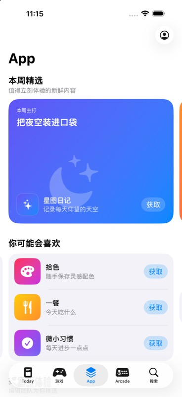

# 布局与吸附机制

## 两层滚动

页面只有一个纵向 `ScrollView`，内部用 `LazyVStack` 承载多个 section。每个 section 再拥有独立的横向 `ScrollView` 和 `LazyHStack`，因此纵向手势浏览栏目，横向手势浏览当前栏目内容。

## 为什么能按组停靠

横向容器没有把每个 App 行直接作为 target。数据层先通过 `GroupingStrategy` 把列表切成三行一组的 `AppGroupPage`，视图层再把整个 `AppGroupPageView` 放进 `LazyHStack`。

```swift
LazyHStack(spacing: pageSpacing) {
    ForEach(section.pages) { page in
        AppGroupPageView(page: page)
            .containerRelativeFrame(.horizontal, count: count, span: 1, spacing: pageSpacing)
    }
}
.scrollTargetLayout()
```

外层横向滚动使用：

```swift
.scrollTargetBehavior(.viewAligned)
```

`scrollTargetLayout()` 把每个 page 注册为可对齐目标，`viewAligned` 在手势结束后选择最接近的 page。因为一个 page 内已经包住三行，所以最终是“三行一起停靠”，而不是每一行分别吸附。

## “浏览类别”为何一次只移动一列

“浏览类别”在 compact 宽度下一屏同时显示两列，但“两列可见”不等于“两列组成一页”。数据层把上下两张类别卡包装成一个 `CategoryColumn`，视图层只把这一整列注册为 scroll target：

```swift
LazyHStack(spacing: pageSpacing) {
    ForEach(columns) { column in
        CategoryColumnView(column: column)
            .containerRelativeFrame(.horizontal, count: 2, span: 1, spacing: pageSpacing)
    }
}
.scrollTargetLayout()
```

Apple 提供的 `alwaysByOne` 表达了“一次交互最多一个 view”的意图。Demo 的自定义 behavior 先让它完成 view-aligned 计算，再把最终 target 相对手势起点的位移硬限制为一列宽度：

```swift
ViewAlignedScrollTargetBehavior(
    limitBehavior: .alwaysByOne,
    anchor: .leading
)
.updateTarget(&target, context: context)

let columnWidth =
    (context.containerSize.width - totalGapWidth) / CGFloat(visibleColumnCount)
let oneColumnDistance = columnWidth + spacing
target.rect.origin.x = startingX + min(abs(proposedDelta), oneColumnDistance) * direction
```

这里的一列宽度由 `context.containerSize`、当前可见列数和间距推导，不需要读取 `UIScreen` 或使用 `GeometryReader`。因此快速甩动也只能从当前列移动到相邻一列。这里的 view 是 `CategoryColumnView`，不是单张卡，也不是两列合成的整页。Apple 文档：[ViewAlignedScrollTargetBehavior.LimitBehavior.alwaysByOne](https://developer.apple.com/documentation/swiftui/viewalignedscrolltargetbehavior/limitbehavior/alwaysbyone)。

## 如何从日志读懂这两个机制

页面首次出现、或横向 size class 导致可见列数改变时，会输出：

```text
[宽度自适应] sizeClass=compact, visibleColumnCount=2, spacing=14.0 ...
```

这条日志对应 `containerRelativeFrame(.horizontal, count: 2, span: 1, spacing: 14)`：SwiftUI 使用横向 `ScrollView` 的可用宽度作为容器宽度，扣掉同屏列间距后平均分成两份，每个 `CategoryColumnView` 占一份。切到 regular 时只有 `count` 变为 4，同一套布局会自动变为一屏四列。

一次横向手势结束时，会输出：

```text
[横向对齐] startingX=..., naturalTargetX=..., viewAlignedTargetX=..., \
columnWidth=(containerWidth-(visibleColumnCount-1)*spacing)/visibleColumnCount=..., \
oneColumnDistance=columnWidth+spacing=..., finalTargetX=..., didClamp=true
```

其中：

- `naturalTargetX` 是系统根据手势速度和减速率预估的自然停止位置，快速甩动可能很远。
- `viewAlignedTargetX` 是 `ViewAlignedScrollTargetBehavior` 选择的最近一列，并按 `.leading` 对齐后的目标。
- `columnWidth` 使用 `TargetContext.containerSize` 反推当前设备上的真实列宽。
- `oneColumnDistance` 是一次允许前进的最大距离，即一列宽加一个列间距。
- `finalTargetX` 是最终交还给 `ScrollView` 的位置；`didClamp=true` 表示原目标超过一列，已被收紧为只移动一列。

## 不同屏幕宽度

- compact 宽度：每屏一个 page，下一页在右侧轻微延伸，强调可横滑。
- regular 宽度：每屏两个 page，更充分利用 iPad 宽度；每个 page 依旧是独立吸附目标。
- “浏览类别”：compact 宽度每屏两列，regular 宽度每屏四列；无论当前可见几列，吸附目标始终是一列。
- `TabView` 使用 `.sidebarAdaptable`，在 iPhone 保持底部 tab，在更宽设备上由系统选择更合适的导航表现。

所有数据与图形均为离线虚构内容，不依赖真实 App Store 接口或第三方素材。

## 公开参考的边界

Apple 的 [App Store 官方介绍页](https://www.apple.com/app-store/) 展示了“栏目标题 + 编辑精选大卡片”的发现型视觉语言，但它不是当前设备上逐像素的 `App` Tab 规范。这个 Demo 因此只复现用户明确指定、且可以用公开素材交叉确认的信息架构，不声称复制服务端实时内容、品牌素材或某个特定系统版本的每个像素。

## 模拟器验证

- iPhone 17 Pro Max：首屏展示大卡与三行列表；横滑后三行内容从第一组整体切换到第二组，并与同一左边距对齐。
- iPhone 17 Pro Max：“浏览类别”初始显示第 1–2 列，`distance: 1`、`duration: 0.1s` 的快速左甩后仅显示第 2–3 列。
- iPad Pro 13 英寸：regular 宽度下一屏同时显示两个普通 page、四个类别列；同样的快速左甩只从第 1–4 列前进到第 2–5 列，导航自动切换为侧栏。
- 可访问性标识 `section-scroll-<section-id>` 用于把 UI 自动化手势精确发送到目标横向 section，避免与外层纵向滚动混淆。


