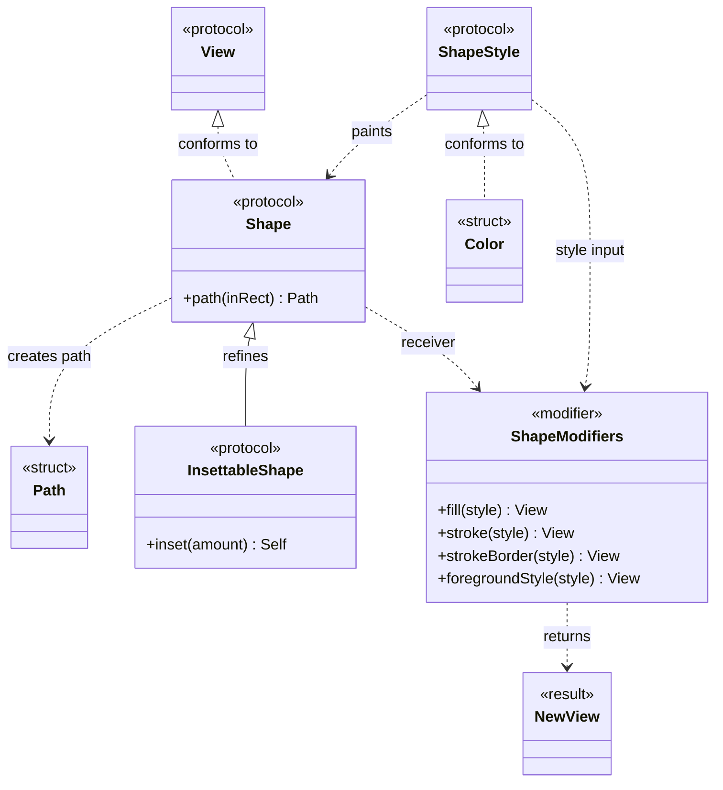

## 想搞清楚的问题

SwiftUI 里有一组概念很容易混在一起：`Shape`、`Path`、`View`、`ShapeStyle`、`Color`、modifier、`InsettableShape`。

它们经常出现在同一段代码里：

```swift
Circle()
    .fill(.blue)
    .frame(width: 120, height: 120)
```

这段代码看起来像是在“画一个蓝色圆”。但如果想继续理解 `.stroke()`、`.strokeBorder()`、`.foregroundStyle()`、gradient、material，问题就会变得不那么直观：

- `Circle()` 是一个 `View`，还是一个 `Shape`？
- `Shape` 和 `Path` 是什么关系？
- `.fill(.blue)` 返回的还是 `Shape` 吗？
- `Color` 是颜色值，为什么也可以放在需要 `ShapeStyle` 的地方？
- `.stroke()` 和 `.strokeBorder()` 为什么不是同一件事？
- modifier 到底是在“修改原来的 view”，还是产生一个新的 view？

这个 demo (`swiftui-shape-view-style-color`) 的目标不是做完整绘图教程，而是把这几个概念的边界用一个可运行页面拆清楚。

## 最终理解

核心结论可以压成一句话：

**`Shape` 是几何抽象，它在给定 rect 里生成具体 `Path`；`ShapeStyle` 负责描述怎么绘制，`Color` 是最常见的一种 `ShapeStyle`，modifier 把这些选择组合成新的 `View`。**



这张图按“类图”的方式读：

- 从上往下看主层级：`View` / `ShapeStyle` 是基础协议，`Shape` / `Color` 是进入体系的具体入口，`InsettableShape` / `Path` 是对形状能力的细化或产物。
- 空心三角箭头表示协议细化或类型 conform，例如 `InsettableShape` 细化 `Shape`，`Color` conform to `ShapeStyle`。
- 虚线箭头表示使用或返回关系，例如 `Shape.path(in:)` 生成 `Path`，`.fill()` / `.stroke()` / `.foregroundStyle()` 使用 `ShapeStyle` 并返回新的 `View`。
- `Shape` 本身 conform to `View`，所以它能进入 SwiftUI view tree；但它的几何轮廓仍然是通过 `path(in:) -> Path` 生成的。
- `InsettableShape` 提供 `inset(by:)` 能力，因此 `.strokeBorder()` 可以把描边放在边界内。

这张图刻意没有把每个 SwiftUI modifier 都拆成独立类型。原因是博客想讲的是“概念关系”，不是还原 SwiftUI 内部所有泛型类型。如果把 `.fill()`、`.stroke()`、`.foregroundStyle()`、`.strokeBorder()` 都拆成独立节点，图会很快变成箭头交叉的实现细节；合并成 `ShapeModifiers` 后，重点更清楚：

1. `Shape` 是 modifier 的接收者。
2. `ShapeStyle` 是绘制相关 modifier 的输入。
3. modifier 的结果不再是原来的 shape，而是新的 `View` 描述。

所以这张图的读法是：**先看上半部分的协议/类型层级，再看下半部分的组合流程。**

Demo 第一屏的标题就是这条路径：

```swift
Text("Shape -> View -> Modifier")
Text("Shape 提供几何，ShapeStyle 提供绘制方式，modifier 把这些选择组合成新的 View。")
```

对应代码在 `swiftui-shape-view-style-color/SwiftUIShapeViewStyleColor/ContentView.swift`。

为了让这些概念不是只停留在文字上，demo 把概念关系和实验数据放在一个纯 Swift model 里：

```swift
static let teachingOrder: [ConceptNode] = [
    .init(id: "shape", title: "Shape", summary: "描述几何轮廓，例如 Circle、RoundedRectangle 或自定义 Path。", symbolName: "circle.hexagongrid"),
    .init(id: "view", title: "View", summary: "SwiftUI 可以放进层级并参与 layout、渲染和 modifier 链的节点。", symbolName: "rectangle.stack"),
    .init(id: "shapeStyle", title: "ShapeStyle", summary: "决定 shape 如何被填充、描边或绘制，几何和外观因此可以分开。", symbolName: "paintpalette"),
    .init(id: "color", title: "Color", summary: "颜色值本身也符合 ShapeStyle，是最常见的绘制输入。", symbolName: "drop.fill"),
    .init(id: "modifier", title: "Modifier", summary: "fill、stroke、foregroundStyle 等 modifier 接收值并返回新的 view。", symbolName: "slider.horizontal.3"),
    .init(id: "insettableShape", title: "InsettableShape", summary: "允许 shape 向内收缩，因此 strokeBorder 可以把描边放在边界内侧。", symbolName: "inset.filled.rectangle"),
]
```

这组数据不是为了抽象，而是为了让 demo 的教学顺序可以被测试固定下来。它和上面的类图不是同一种排序：类图按“类型层级”从上往下摆，demo 的 `teachingOrder` 则按读者更容易理解的学习路径组织，先从 `Shape` 这个最容易看到的入口开始，再补 `View`、`ShapeStyle`、`Color`、modifier 和 `InsettableShape`。

## Shape 和 Path：抽象形状与具体轮廓

`Shape` 和 `Path` 最容易被混淆。一个实用区分是：

- `Shape` 是协议和抽象：它描述“我能在某个 rect 里画出自己的轮廓”。
- `Path` 是结果数据：它是某一次在具体 rect 中生成出来的线段、曲线和闭合区域。

从协议形态看，`Shape` 的核心就是生成 `Path`：

```swift
func path(in rect: CGRect) -> Path
```

同一个 `Shape` 在不同尺寸的 rect 里可以生成不同的 `Path`。这就是为什么 `Circle()` 不需要提前知道自己有多大；SwiftUI layout 之后会给它一个 rect，它再在这个 rect 里生成实际轮廓。

Demo 里的 `DemoShape` 也遵循这个模型：

```swift
func path(in rect: CGRect) -> Path {
    let insetRect = rect.insetBy(dx: insetAmount, dy: insetAmount)

    switch kind {
    case .circle:
        return Circle().path(in: insetRect)
    case .roundedRectangle:
        return RoundedRectangle(cornerRadius: 32).path(in: insetRect)
    case .capsule:
        return Capsule().path(in: insetRect)
    }
}
```

这里 `DemoShape` 不是直接保存一个固定 `Path`，而是保存“如何按当前 kind 和 inset 生成 path”的规则。这个差异很重要：`Shape` 可以适应 layout，`Path` 则是某次计算后的具体轮廓。

## Shape：先描述几何，不急着决定外观

`Shape` 最适合被理解成“几何描述”。`Circle`、`RoundedRectangle`、`Capsule` 都能回答一个问题：在给定 rect 里，这个形状的 path 是什么？

Demo 里用 `DemoShapeKind` 提供三个可切换形状：

```swift
enum DemoShapeKind: String, CaseIterable, Identifiable {
    case circle
    case roundedRectangle
    case capsule
}
```

真正渲染时，再把选择转换成一个统一的 `DemoShape`：

```swift
private func demoShape(_ shape: DemoShapeKind) -> DemoShape {
    DemoShape(kind: shape)
}
```

这个拆分让页面状态保持简单：UI 只保存“当前选的是哪种 shape”，而不是保存某个复杂 view。

## Shape 什么时候变成 View？

`Shape` 本身在 SwiftUI 里可以作为 view 放进层级，但它要变得“可见”，还需要参与 layout，并通常需要一个绘制方式。

第一个实验 `Shape becomes View` 就是为了看这个转换：

```swift
demoShape(shape)
    .fill(swiftUIColor(color))
    .frame(height: 160)
```

这里可以拆成三层理解：

1. `demoShape(shape)` 选择几何。
2. `.fill(swiftUIColor(color))` 选择填充方式。
3. `.frame(height: 160)` 让它进入 layout，得到可见尺寸。

所以更准确的说法不是“`Shape` 等于 `View`”，而是：**`Shape` 可以进入 view tree；通过 fill、stroke、layout modifier 等组合后，它成为实际可见的 UI。**

## ShapeStyle：外观和几何分开

第二个实验 `ShapeStyle paints Shape` 刻意让 shape 和 style 分开选。

```swift
demoShape(shape)
    .fill(shapeStyle(style))
    .frame(height: 160)
```

`shapeStyle(_:)` 返回的是 `AnyShapeStyle`：

```swift
private func shapeStyle(_ style: DemoShapeStyleKind) -> AnyShapeStyle {
    switch style {
    case .solid:
        AnyShapeStyle(.blue)
    case .gradient:
        AnyShapeStyle(.linearGradient(colors: [.blue, .purple], startPoint: .topLeading, endPoint: .bottomTrailing))
    case .material:
        AnyShapeStyle(.regularMaterial)
    }
}
```

这里最重要的不是 `AnyShapeStyle` 本身，而是它让 demo 可以在同一个位置切换三种绘制方式：

- solid color
- gradient
- material

几何没有变，变的是绘制输入。这就是 `Shape` 和 `ShapeStyle` 分开的价值。

## Color：既是颜色值，也是一种 ShapeStyle

`Color` 很容易被当作一个普通颜色值理解，这没错，但在 SwiftUI 的 shape 绘制上下文里它还可以作为 `ShapeStyle` 使用。

第三个实验 `Color as ShapeStyle` 把 color 和 gradient 放在一起：

```swift
Circle()
    .fill(swiftUIColor(color))

Circle()
    .fill(.linearGradient(colors: [.pink, swiftUIColor(color)], startPoint: .topLeading, endPoint: .bottomTrailing))
```

从调用点看，`.fill(...)` 接收的是绘制方式。`Color` 是最简单的一种；gradient 是另一种。理解这一点之后，`.fill(.blue)` 就不只是“填一个颜色”，而是“用一个 ShapeStyle 去 paint shape”。

这也解释了为什么可以把 `Color`、gradient、material 放在同一条概念线上讨论。

## Modifier：不是原地修改，而是组合出新的 View

SwiftUI 代码经常写成链式：

```swift
demoShape(shape)
    .fill(swiftUIColor(color))
    .frame(height: 160)
    .overlay(alignment: .bottom) {
        Text("\(shape.title)().fill(\(color.title.lowercased()))")
    }
```

直觉上会把它读成“修改这个 shape”。但 SwiftUI 里更安全的理解是：**每个 modifier 接收前一个值，再返回一个新的 view 描述。**

这也是为什么 demo 把 `Modifier` 放进概念图里。它不是和 `Shape`、`Color` 平级的绘制材料，而是把这些材料串起来的组合机制。

当我们说 `.fill()`、`.stroke()`、`.foregroundStyle()` 时，真正要问的是：

- 它接收什么输入？
- 它返回的是什么 view？
- 后续 modifier 是继续作用在这个返回值上，还是仍然作用在最开始的 shape 上？

这个问题在 `.stroke()` 和 `.strokeBorder()` 上尤其明显。

## stroke 和 strokeBorder：为什么需要 InsettableShape

`.stroke()` 和 `.strokeBorder()` 都是在描边，但它们的边界语义不同。

Demo 的第四个实验 `Stroke vs StrokeBorder` 用同一个 `RoundedRectangle` 对比：

```swift
if mode == .stroke {
    RoundedRectangle(cornerRadius: 36)
        .stroke(.orange, lineWidth: lineWidth)
} else {
    RoundedRectangle(cornerRadius: 36)
        .strokeBorder(.orange, lineWidth: lineWidth)
}
```

`stroke` 可以理解成沿 shape 的边界居中画线；线宽变大时，一部分会向外扩，一部分向内扩。`strokeBorder` 则依赖 `InsettableShape`，可以把描边约束在边界内侧。

Demo 里也实现了一个最小 `InsettableShape`：

```swift
private struct DemoShape: InsettableShape {
    let kind: DemoShapeKind
    var insetAmount = 0.0

    func path(in rect: CGRect) -> Path {
        let insetRect = rect.insetBy(dx: insetAmount, dy: insetAmount)
        ...
    }

    func inset(by amount: CGFloat) -> DemoShape {
        var shape = self
        shape.insetAmount += amount
        return shape
    }
}
```

这段代码说明了 `InsettableShape` 的关键能力：shape 能根据传入的 inset 生成一个向内缩过的 path。`strokeBorder` 正是利用这个能力控制描边位置。

## 为什么把教学数据写成 model？

这个 demo 的 UI 很简单，但仍然把概念和实验元数据放进 `DemoModel.swift`，不是因为它需要复杂架构，而是因为这些关系本身就是 demo 的结论。

测试文件 `SwiftUIShapeViewStyleColorTests/DemoModelTests.swift` 验证四件事：

```swift
#expect(ConceptNode.teachingOrder.map(\.id) == [
    "shape",
    "view",
    "shapeStyle",
    "color",
    "modifier",
    "insettableShape",
])
```

还会验证：

- 每个概念都有标题、说明和 symbol。
- 四个实验的 identity 稳定。
- 核心关系边存在：`Shape -> View`、`ShapeStyle -> Shape`、`Color -> ShapeStyle`、`Modifier -> View`、`InsettableShape -> strokeBorder`。

这类测试不测试 SwiftUI 渲染细节，而是测试“这篇 demo 想讲的知识结构有没有被改坏”。

## 怎么运行和验证

生成项目：

```bash
cd swiftui-shape-view-style-color
xcodegen generate
```

打开项目：

```bash
open SwiftUIShapeViewStyleColor.xcodeproj
```

运行测试：

```bash
xcodebuild test \
  -project SwiftUIShapeViewStyleColor.xcodeproj \
  -scheme SwiftUIShapeViewStyleColor \
  -destination 'platform=iOS Simulator,name=iPhone 17 Pro Max,OS=latest'
```

这个 demo 也带了 `.xcodebuildmcp/config.yaml`，所以 agent 可以直接用 XcodeBuildMCP 选择同一个 project、scheme 和 simulator。

本次验证使用 XcodeBuildMCP `test_sim`，发现并通过了 4 个 Swift Testing case。

## 这次学到的规则

- `Shape` 先描述几何，不负责最终视觉外观。
- `ShapeStyle` 决定怎么 paint shape；同一个 shape 可以换不同 style。
- `Color` 是最常见、最简单的一种 `ShapeStyle`。
- modifier 链不是原地修改对象，而是不断组合出新的 view 描述。
- `.stroke()` 和 `.strokeBorder()` 的区别不只是名字不同，而是描边相对 shape 边界的位置不同。
- `InsettableShape` 的价值在于让 shape 可以向内收缩，从而支持 `strokeBorder` 这种边界内描边。
- 对教学型 demo 来说，测试可以锁定“概念顺序”和“关系边”，不一定要测试像素级 UI。

如果以后继续扩展，可以把 `foregroundStyle`、`background`、`clipShape`、`mask` 放进同一套关系图里。但这个 demo 先停在 `Shape`、`View`、`ShapeStyle`、`Color`、modifier、`InsettableShape` 这条主线上，避免变成完整 SwiftUI 绘图手册。
