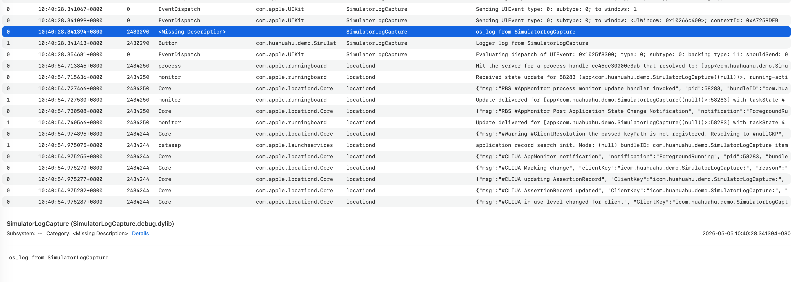
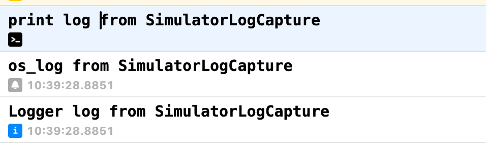

# 在 Agentic Coding 中捕获 iOS Simulator 日志

> Investigation：一次关于 `print`、`os_log`、`Logger` 在 iOS Simulator 中如何被 Console、Xcode Console 和 `simctl log stream` 捕获的实验记录。

这篇文章记录一次最小 SwiftUI demo 的实验：点击按钮后分别用 `print`、`os_log` 和 `Logger` 输出日志，再观察 agent 能否通过不同方式拿到这些日志。

- Demo：[`simulator-log-capture`](../../simulator-log-capture/README.md)
- 原始结果：[`simctl-log-stream.txt`](../../simulator-log-capture/result/simctl-log-stream.txt)
- Demo app：`SimulatorLogCapture`
- Simulator：`iPhone 17 Pro Max`，iOS 26.4
- Bundle ID：`com.huahuahu.demo.SimulatorLogCapture`

## 实验问题

在 agentic coding 场景里，agent 通常不能直接盯着 Xcode Console。如果 app 只是在 Simulator 中运行，哪种日志方式最容易被自动化工具捕获？

## Demo 做了什么

Demo 刻意保持简单：一个 SwiftUI 页面，一个按钮。点击 `Print Logs` 按钮时，同时触发三种日志输出。

```swift
Button("Print Logs") {
    print("print log from SimulatorLogCapture")
    os_log("os_log from SimulatorLogCapture")
    logger.info("Logger log from SimulatorLogCapture")
}
```

代码在 `simulator-log-capture/SimulatorLogCapture/ContentView.swift`。项目由 XcodeGen 生成，并带有 `.xcodebuildmcp/config.yaml`，方便 agent 使用固定的 scheme 和 simulator。

## 三种观察方式

### Console app

Console app 可以选择 booted simulator 并按进程名过滤。它适合人工观察，但不适合 agent 自动化记录结论。



### Xcode Console

从 Xcode 运行 app 时，debug console 能看到运行期输出。这个方式对开发者最直接，但 agent 如果运行在终端中，通常不能稳定读取这个 UI 面板。



### simctl log stream

终端方式最适合 agentic coding，因为命令输出可以被保存、过滤和回写到结果文件。

本机 Xcode 的 `simctl` 没有直接的 `log` 子命令：

```bash
xcrun simctl log stream booted --predicate 'process == "SimulatorLogCapture"'
```

实际返回：

```text
Unrecognized subcommand: log
```

所以实际可用命令是通过 `simctl spawn` 在模拟器环境中执行 `log stream`。

## 关键发现：需要 `--level info`

第一次只用默认 `log stream` 时，能捕获到 `os_log`，但没有看到 `Logger.info`。

重新加上 `--level info` 后，`Logger.info` 才出现在结果里：

```bash
xcrun simctl spawn F8AFBC61-0935-4C51-826E-E03D6DCD3D71 \
  log stream \
  --level info \
  --predicate 'process == "SimulatorLogCapture"' \
  --style compact
```

这次捕获到的自定义日志是：

```text
2026-05-05 11:15:11.384 Df SimulatorLogCapture[...] (SimulatorLogCapture.debug.dylib) os_log from SimulatorLogCapture
2026-05-05 11:15:11.384 I  SimulatorLogCapture[...] [com.huahuahu.demo.SimulatorLogCapture:Button] Logger log from SimulatorLogCapture
```

## 结论

- `simctl spawn ... log stream` 是本次 agent 自动化最可复现的方式。
- 想捕获 `Logger.info`，命令里应加 `--level info`。
- `os_log` 在默认流里已经可见。
- 本次 `print` 没有在 `simctl log stream` 结果中作为 unified logging 出现。

## 推荐命令

如果只有一个 simulator booted：

```bash
xcrun simctl spawn booted log stream \
  --level info \
  --predicate 'process == "SimulatorLogCapture"' \
  --style compact
```

如果有多个 simulator booted，建议把 `booted` 换成 demo 配置里的 simulator UUID：

```bash
xcrun simctl spawn F8AFBC61-0935-4C51-826E-E03D6DCD3D71 log stream \
  --level info \
  --predicate 'process == "SimulatorLogCapture"' \
  --style compact
```
