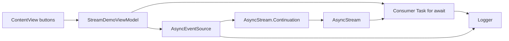

# AsyncStream Continuation Demo Design

## 目标

创建一个独立的 iOS SwiftUI demo，用最小界面解释 `AsyncStream` 与 `Continuation` 的工作方式，重点展示：

- `AsyncStream.makeStream` 如何同时产出 stream 和 continuation。
- producer 如何通过 continuation `yield` 和 `finish`。
- consumer 如何通过 `for await` 消费事件。
- consumer cancel、producer finish、owner release 时 cleanup 的触发顺序。
- 为什么不能只依赖 `deinit` 做清理，`onTermination` 才是 stream 生命周期的关键释放钩子。
- 为什么高频或长期 producer 不应使用默认 unbounded buffer。

关键生命周期事件全部使用 `Logger` 输出，供 Xcode console、Simulator console 或系统日志查看。

## Demo 形态

新建目录：

```text
async-stream-continuation-demo/
  README.md
  project.yml
  AsyncStreamContinuationDemo/
  AsyncStreamContinuationDemoTests/
```

App 与 scheme 名称为 `AsyncStreamContinuationDemo`。项目使用 XcodeGen，从仓库现有 template 生成，deployment target 为 iOS 26.0，Swift 6.0。

首屏只负责触发和解释，不做内置实时日志列表：

- 顶部：简短解释 `AsyncStream`、continuation、consumer task、termination cleanup 的关系。
- 中部：展示当前状态，例如 idle、running、finished、cancelled、released。
- 底部：四个操作按钮。
  - `Start Stream`
  - `Cancel Consumer`
  - `Finish Producer`
  - `Drop Owner`

日志查看方式写入 README：优先看 Xcode console；也可以通过 Simulator/system log 查看 `Logger` 输出。

## 组件设计

### `ContentView`

SwiftUI 入口视图，只负责：

- 展示概念说明。
- 展示 view model 当前状态。
- 调用 view model 暴露的用户动作。

视图不直接持有 continuation，也不直接创建 stream，避免 UI 和并发生命周期耦合。

### `StreamDemoViewModel`

主线程隔离的 observable view model，负责：

- 保存当前 `AsyncEventSource?`。
- 保存 consumer `Task<Void, Never>?`。
- 响应四个按钮动作。
- 在 `Start Stream` 时创建 source 并启动 consumer task。
- 在 `Cancel Consumer` 时取消 consumer task。
- 在 `Finish Producer` 时调用 source 的 `finish()`。
- 在 `Drop Owner` 时先显式 finish source、取消 consumer task，再释放 source 引用，用来观察 owner release 与 stream termination 的关系。
- 在 `deinit` 中取消 consumer task 并记录日志。

consumer task 中使用：

```swift
for await event in source.events {
    logger.debug("consumer received \(event)")
}
```

`for await` 结束后记录 consumer end，帮助观察 finish 与 cancel 的差异。

### `AsyncEventSource`

封装 producer 侧逻辑，负责：

- 使用 `AsyncStream.makeStream(of:bufferingPolicy:)` 创建 stream 和 continuation。
- 采用 `.bufferingNewest(10)`，避免默认 `.unbounded` 给学习者留下错误示范。
- 保存 continuation。
- 启动一个 producer task，每隔约 0.7 秒 yield 一个递增事件。
- 记录 `yield` 的结果，展示事件是否被 enqueue、dropped 或 terminated。
- 提供 `finish()`，只负责显式结束 continuation。
- 设置 `continuation.onTermination`，在 consumer cancel、stream 释放或 finish 后执行 cleanup。
- cleanup 中取消 producer task，并记录 termination reason。
- `deinit` 只记录日志和兜底取消 producer task，不作为唯一释放路径。

### `StreamEvent`

简单 value type，包含：

- 递增序号。
- 创建时间。
- 简短 message。

用于让 console 日志可读。

## 数据流与生命周期



启动流程：

1. 用户点击 `Start Stream`。
2. view model 创建 `AsyncEventSource`。
3. source 调用 `AsyncStream.makeStream`，保存 continuation，设置 `onTermination`。
4. source 启动 producer task，周期性 `yield`。
5. view model 启动 consumer task，通过 `for await` 读取 stream。
6. producer 与 consumer 都通过 `Logger` 输出关键事件。

结束流程：

- `Finish Producer`：source 调用 `continuation.finish()`，consumer 的 `for await` 正常结束，`onTermination` 执行 cleanup。
- `Cancel Consumer`：consumer task 被取消，`for await` 停止，continuation 收到 termination，cleanup 取消 producer。
- `Drop Owner`：view model 先 finish source、取消 consumer task，再释放 source 引用；demo 会通过日志说明仅释放 owner 并不等同于正确结束 stream。

## 需要重点打日志的位置

统一使用 `Logger(subsystem: "com.huahuahu.demo.AsyncStreamContinuationDemo", category: "...")`。

关键日志点：

- stream created
- continuation stored
- producer task started
- yield requested
- yield result
- consumer task started
- consumer received event
- cancel requested
- finish requested
- for-await loop ended
- continuation onTermination reason
- cleanup started
- cleanup completed
- source deinit
- view model deinit

这些日志用于解释“是谁结束了 stream”“cleanup 是否运行”“对象是否释放”“finish/cancel/deinit 的顺序差异”。

## 内存管理与释放规则

demo 需要明确表达以下规则：

1. continuation 是 producer 往 stream 里送值的句柄。持有 continuation 就等于 producer 仍有可能继续发事件。
2. stream 不会自动替 producer 做业务 cleanup。producer task、timer、delegate、callback 订阅等资源必须在 `onTermination` 或显式 cleanup 中停止。
3. `finish()` 表示 producer 正常结束；consumer cancel 表示下游不再需要值。两者都应该走 cleanup。
4. `deinit` 可以作为最后兜底，但不能作为唯一 cleanup 机制，因为引用关系、consumer task、continuation、producer task 可能让对象释放时机晚于预期。
5. 默认 `.unbounded` buffer 可能无限积累值。demo 使用 `.bufferingNewest(10)`，并在 README 解释生产速度高于消费速度时的内存风险。
6. consumer task 需要被保存并可取消，否则 view model 生命周期结束后可能留下不必要的工作。

## 测试策略

测试只覆盖非 UI 逻辑：

- source start 后能产出事件。
- `finish()` 会让 stream 结束。
- 取消 consumer 后会触发 termination cleanup。
- cleanup 后 producer 不再继续产出事件。

测试不依赖固定长时间 sleep；如需等待事件，使用短 timeout helper，避免测试无限挂起。

## 验证计划

实现阶段完成后：

1. 在 `async-stream-continuation-demo/` 运行 `xcodegen generate`。
2. 创建专用 simulator：`AsyncStreamContinuationDemo iPhone 17 Pro Max`。
3. 更新仓库根目录 `.xcodebuildmcp/config.yaml`，指向新 demo 的 `.xcodeproj`、scheme、simulatorName 和 simulatorId。
4. 在首次 XcodeBuildMCP build/run/test 前调用 `session_show_defaults`。
5. 如果 active defaults 与 `.xcodebuildmcp/config.yaml` 不一致，使用 `session_set_defaults` 应用相同值。
6. 使用 XcodeBuildMCP `test_sim` 验证测试。

## 非目标

- 不做复杂 UI 或内置日志 viewer。
- 不引入第三方框架。
- 不覆盖 `AsyncThrowingStream`，除非 README 简短提及与本 demo 的区别。
- 不演示 Combine、delegate 或 callback 桥接；这些可作为后续独立 demo。
