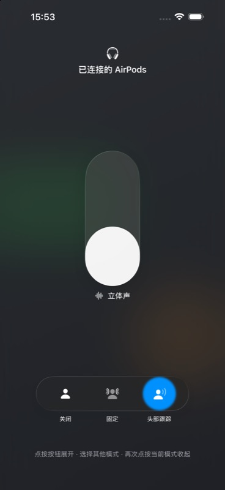

# 空间音频模式选择器 Demo

这个 iOS 26 SwiftUI Demo 复刻控制中心 AirPods「空间化立体声」选择器的动画语言：紧凑圆形按钮展开为三段玻璃胶囊，同一个选中圆在模式之间连续滑动并同步变色，当前模式图标在收起时回到中央。

## 运行环境

- Xcode 26
- iOS 26.0+
- Swift 6
- XcodeGen 2.46+

## 生成、运行与测试

```bash
cd spatial-audio-mode-picker-demo
xcodegen generate
open SpatialAudioModePickerDemo.xcodeproj
```

选择 `SpatialAudioModePickerDemo` scheme 后运行。点按紧凑按钮展开，点按不同模式观察选中圆移动；再次点按当前模式即可收起。

## 关键代码

- `Domain/SpatialAudioMode.swift`：三种模式的稳定顺序、文案、SF Symbol 与激活语义。
- `Features/SpatialAudioPicker/SpatialAudioPickerModel.swift`：展开、收起与选择行为。
- `Features/SpatialAudioPicker/SpatialAudioModePicker.swift`：动画事务、Reduce Motion 和触觉反馈入口。
- `Features/SpatialAudioPicker/SpatialAudioPickerControl.swift`：保持外壳、选中圆和选项图标的连续身份。
- `Features/SpatialAudioPicker/SpatialAudioSelectionIndicator.swift`：灰色关闭态与蓝色开启态之间的连续玻璃选中圆。
- `Features/SpatialAudioPicker/SpatialAudioPickerLabels.swift`：紧凑摘要与三段标签的交叉切换。
- `Support/SpatialAudioDesign.swift`：集中维护尺寸和动画参数。

## 实现取舍

Demo 使用 iOS 26 原生 `GlassEffectContainer` 与 `glassEffect`。外壳和选中圆都保持为长期存在的 View，只改变宽度、偏移和 tint，避免用三个独立背景互相淡入淡出。开启 Reduce Motion 后，位移动画会被取消，标签仍保留短促的透明度过渡。

## Simulator 预览

[查看展开、模式切换与收起动画](docs/animation-preview.mp4)


